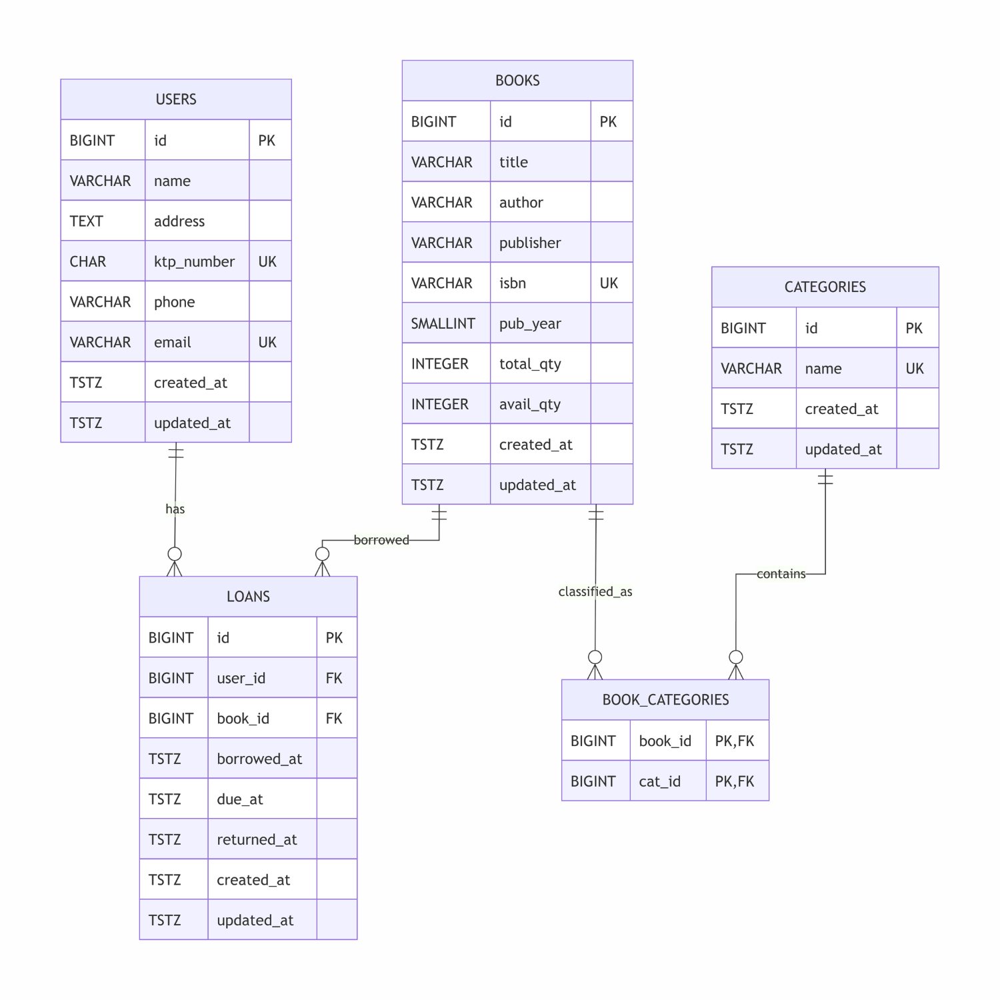

[← Back to main README](../README.md)

# SQL Test — SIPERPUS

Database deliverable for SIPERPUS (Sistem Informasi Perpustakaan).

## ERD



5 tables: `users`, `books`, `categories`, `book_categories` (pivot, N:M), `loans`.

## Files

| File | What |
|---|---|
| `database-test-query.sql` | schema + seed data + reporting queries, one runnable file, in that order |

## Requirements

PostgreSQL 16+. No extensions needed.

## How to run

```bash
createdb siperpus
psql -d siperpus -f database-test-query.sql
```

Or, without creating a database first, against any existing one you have access to:

```bash
psql "$DATABASE_URL" -f database-test-query.sql
```

To re-run from scratch, drop and recreate first:

```bash
dropdb siperpus && createdb siperpus
```

## Queries (section 3 of `database-test-query.sql`)

1. Row counts: expect `users: 5`, `books: 10`, `loans: 9`
2. Loans per user: Users 1–3 have 3 each, Users 4–5 have 0
3. Late returns: one row, Agus Prasetyo, *Sejarah Indonesia Modern*, 5 days late
4. Books with their categories
5. Currently overdue (not returned, past due): empty after seed
6. Books never borrowed by anyone: one row, *Filosofi Teras* (Book 10)
7. Users with a fine for late returns (Rp1.000/hari telat, computed on demand, not a stored column): one row, Agus Prasetyo, Rp5000
8. Users with the list of books they've borrowed (users with zero loans excluded): 3 rows, one per user, newest-book-first

Copy any single `SELECT` out of the file to run it individually.
